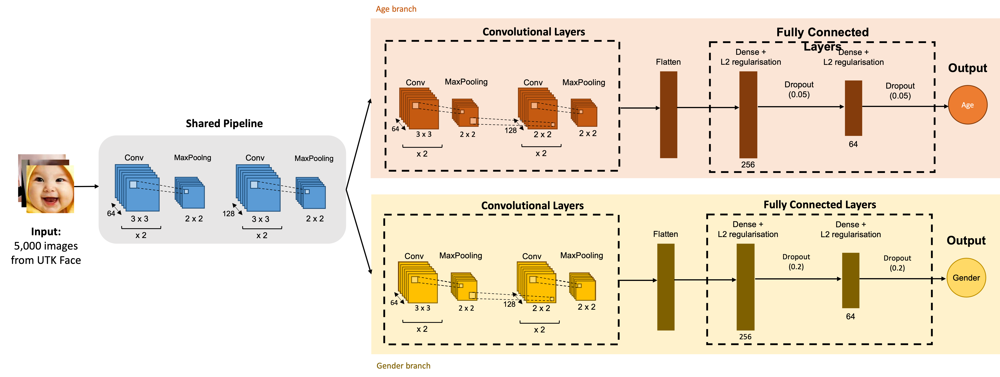
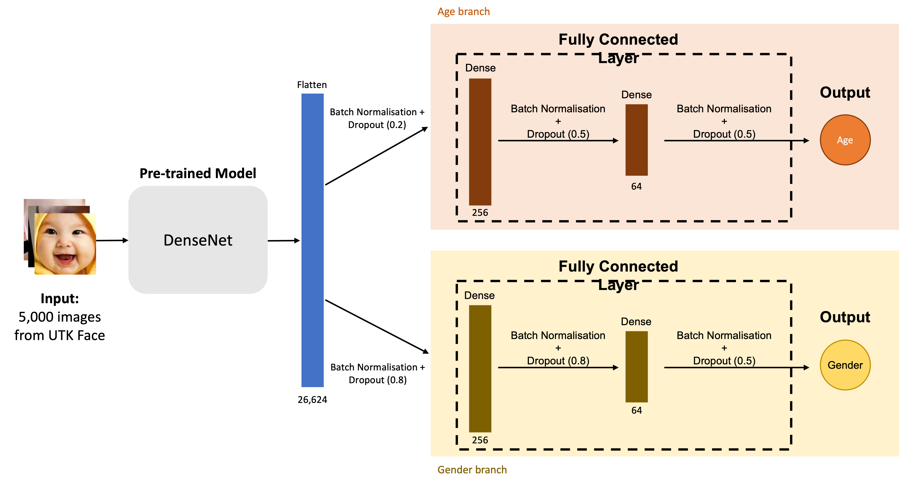

# Age Gender Prediction CNN Network

This is the coursework for CM50265 Machine Learning 2 (Semester 2 - 2022) at the University of Bath. (Grade: 97/100)

## Objective

The goal of this project is to develop CNN models to predict the age and gender of people given face images input. The dataset is a subset of 5,000 images from the [UTKFace dataset](https://susanqq.github.io/UTKFace/). 

Two models are to be built, one from scratch, another with transfer learning.

## Task 1: Model from Scratch

#### Model Architecture

## Task 2: Transfer Learning Model

