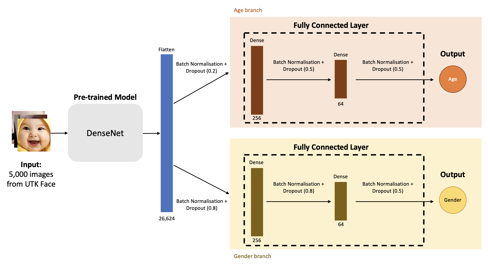

# Age Gender Prediction CNN Network

This is the coursework for CM50265 Machine Learning 2 (Semester 2 - 2022) at the University of Bath. (Grade: 97/100)

## Objective

The goal of this project is to develop CNN models to predict the age and gender of people given face images input. The dataset is a subset of 5,000 images from the [UTKFace dataset](https://susanqq.github.io/UTKFace/). 

Two models are built, one from scratch, another with transfer learning.

## Task 1: Model from Scratch

#### Model Architecture

#### Final model performance
|Number of Epochs| Age MAE| Gender Accuracy|
|--|--|--|
|85|6.12|89.40%|

The model has a shared feature extraction pipeline, and two separated branches for age and gender predictions.

## Task 2: Transfer Learning Model

#### Model Architecture

The model uses DenseNet pretrained on ImageNet for feature extraction, and separate branches of fully connected layers for age and gender prediction respectively.

#### Final model performance

|Number of Epochs| Age MAE| Gender Accuracy|
|--|--|--|
|143|5.75|90.53%|
